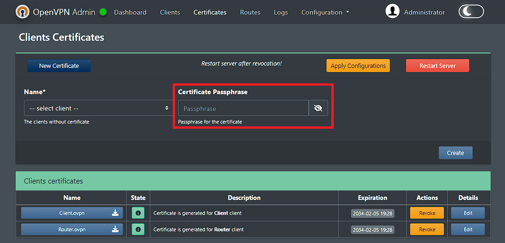
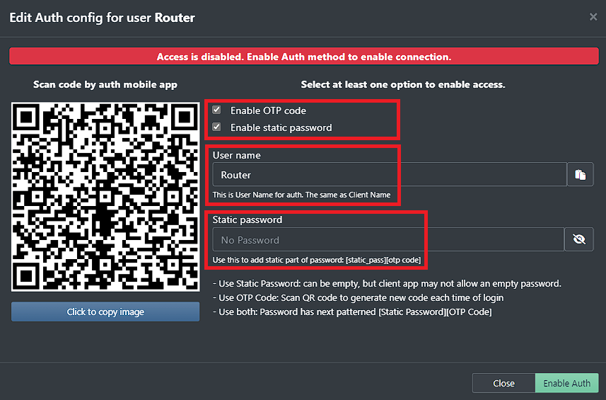
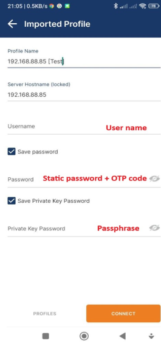

# OpenVPN WEB UI

[](https://github.com/shuricksumy/openvpn-ui/assets/12009686/06d96239-c7f8-4dc2-ab27-f3e4e2b0b6bf)

## Updates
#### February 2024 (v5.1)
  
 - Added env variable **URL_PREFIX** to add leading url prefix for easy configuration proxy pass based on nginx, traefik

#### February 2024 (v5.0)
> **Warning**
There is no back compatibility with previous versions. Need to recreate service from scratch.

- Redesigned UI a bit
- Updated DB to use UUID for entities
- Added Authorization layer: Static Password and/or OTP code


### Previous versions
<details>

<summary>Previous versions details</summary>

#### January 2024 (v4.2)
- Small updates of UI interface: popups, colors, tables, etc..
- Adding Docker builder to use the lates openvpn server
- Adding new docker builder script to support arm64 and go-sqlite3 compilation issues
- Updating task config to support new build scenarios

#### December 2023 (v4.1)
- Small updates in Docker builder files.
- Adding Tasks

#### December 2023 (v4.0)
> **Warning**
 There is no back compatibility with previous versions. Need to recreate service from scratch.
 
- Now it's a solid solution: OpenVPN server is added to docker image
- UI can see the OpenVPN server status and restart it
- For better UX, Wizard was added to configure the OpenVPN server the first time
- The Clients are the first-level entities, stored in DB
- Certificates now can be generated only for created Clients
- Routes system management was added to provide each client with route rules, stored in DB
- Refactored code
- Redesigned UI
- Base bash script for installing is [openvpn-install.sh](https://github.com/shuricksumy/openvpn-install)

#### September 2023 (v3.0)
- New UI web components
- UI updates
#### September 2023 (v2.0 - v 2.4)
- Fixed some issues
- Add script based on go for client's file generation
- Small improvements 
- Added md5 sum checker for client config files to be sure that the current config is used or not
- Fixed small issue
- Now is possible to organize routing between devices on Web UI
    - Added Client details page with Static IP, Routes, Subnet settings, Default Route
    - Added script to generate client config files based on these settings
- It's possible un-revoke certificate
- Redesigned a bit UI

#### Summer 2023 (v 1.0)

- updated all config files and scripts to use `/etc/openvpn/easy-rsa` path
- added the script from [openvpn-install](https://github.com/shuricksumy/openvpn-install) as the main script for generating new clients
- added UI improvements:
  - now user can configure `server.conf` and `client-template` files as plain text
  - new table with certificates
  - add a modal window to edit each client config file separately
  - improved visual part of the log viewer
  - updated client generation and .ovpn file generation
  - added confirmation to Revoke or Delete clients
  - added 4 tabs for Application, Server, Cliemt config and System utils
  - added backuping/downloading of all ovpn directory
- added Docker env variables and improved run-script:
  - disabled auto-provisioning of OpenVPN server part - now wait for a readily configured server
  - added env vars:

  ```bash
  SITE_NAME='Server 1' # The name of the server - displayed on UI. Default value "Admin"
  OPENVPN_SERVER_DOCKER_NAME="vpnserver1" # The name of the Docker container to restart
  OPENVPN_MANAGEMENT_ADDRESS="IP:PORT" # The preconfigured address to connect OpenVPN manager
  ```
  
</details>

## Password/OTP/Passphrase usage

<details>

<summary>Password/OTP/Passphrase usage</summary>

### 3 way implemented to protect connection:
- protect certificate by passphrase
- protect connection by static login/password
- use One Time Password (OTP)

All these methods can be used separately or simultaneously









</details>


## Example docker-compose file

<details>

<summary>Example docker-compose file</summary>

```docker
version: '3'

networks:
    default:
        driver: bridge
    npm_proxy:
        driver: bridge
        ipam:
            config:
                - subnet: 172.18.0.0/24
services:
  ovpn:
        image: shuricksumy/openvpn-ui:latest
        container_name: openvpn-ui
        working_dir: /etc/openvpn/easy-rsa
        environment:
            - OPENVPN_ADMIN_USERNAME=admin # Leave this default as-is and update on first-run
            - OPENVPN_ADMIN_PASSWORD=admin # Leave this default as-is and update on first-run
            - SITE_NAME=Admin
            #- APP_PORT=8080 # Use if need to specify the custom one
            ## this parameter need to use / for spec regex sybols
            #- URL_PREFIX="\/ovpn" # Use general prefix for nginx,traefik proxy pass configuration
        ports:
            - "8080:8080/tcp"
            - "1194:1194/udp"
        restart: always
        networks:
            npm_proxy:
                ipv4_address: 172.18.0.10
        devices:
            - /dev/net/tun
        cap_add:
            - NET_ADMIN
        volumes:
            -  /var/run/docker.sock:/var/run/docker.sock
            - ./openvpn/db:/opt/openvpn-gui/db
            - ./openvpn:/etc/openvpn
            #- ./openvpn/easy-rsa:/etc/openvpn/easy-rsa
```

</details>

References:
- The project is originally based on [https://github.com/d3vilh/openvpn-ui](https://github.com/d3vilh/openvpn-ui)  - big thanks for a great job
- The bash script for setup OpenVPN is based on [https://github.com/angristan/openvpn-install](https://github.com/angristan/openvpn-install) - big thanks for a great job
